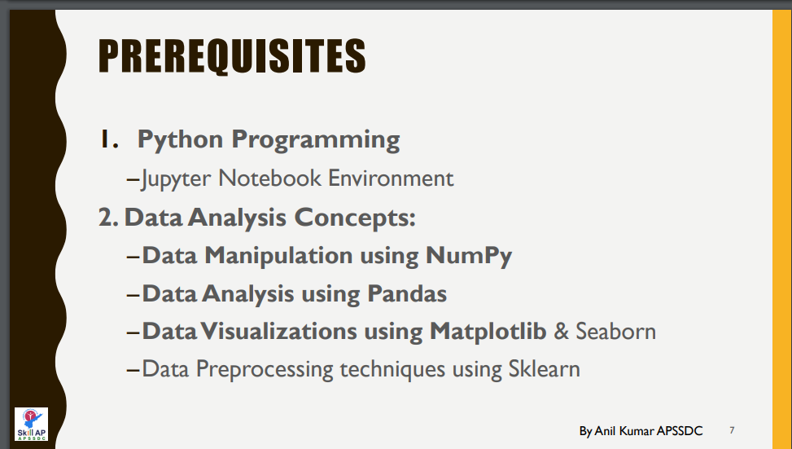

# Machine-Learning-Using-Python

This repository consists of all the files, resources, and recorded session links which are discussed during Machine Learning using Python Online Training.

#### 

#### APSSDC-ML-Datasets → [[Click Here]](https://github.com/AP-State-Skill-Development-Corporation/Datasets)

#### Few resources avaliable @ [[resources.md]](resources.md) file don't forget to use them

### Instructions for attendance

Everyone should compulsory follow the below instruction in order to get the attendance --> Certificate

1. Login format **`rollnumber-name-college`**
2. Don't give spaces in roll number or shorcut of your roll number
3. Don't give spaces between rollnumber and name (only - single minus or hyphen character)
4. Make sure roll number should match with the registered roll number
5. Required attendance minimum **120 minutes out of 150 minutes** session

#### Attendance sheet reference purpose only(make sure to follow above instructions to get present) → [[clickHere]](https://docs.google.com/spreadsheets/d/1xkmgqb9QJbS0yKViK5BH_bc2iPJ_RnNlN9pOL-EJP2U/edit?usp=sharing)

<!-----
#### Your details printed on Certificates verify once → [[clickHere]]()

--->

### Day1 Introduction to Machine Learning (16/Nov/2020)

Discussed Concepts:
1. What is machine Learning
2. Types of ML
3. Applications
4. Algorithms  

* [ML pdf ](Day-1/MachineLearningwithPython.pdf)
* [Anaconda installation pdf](Day-1/AnacondaInstallation.pdf)
* [Notebook](Day-1/Day1_16Nov2020.ipynb)
* [Notes.txt](Day-1/Notes.txt)
* [salary.csv](Day-1/salary.csv)
* [Recorded Video](https://transcripts.gotomeeting.com/#/s/0a91d815c6e7baae729249af21023d36fbfbda2dc90718afaff0d3e23a5e647b)

### Day2 Prediction of RIL revenue by Linear Regression (17/Nov/2020)

Discussed Concepts
1. Linear Regression for
* Prediction of Salary of employee with his experience
* Prediction Reliance Industry revenue with Jio subscribers

* [Notebook](Day-2/Day2_17Nov2020.ipynb)
* [Salary_Data.csv](https://raw.githubusercontent.com/AP-State-Skill-Development-Corporation/Datasets/master/Regression/Salary_Data.csv)
* [Reliance.csv](https://raw.githubusercontent.com/AP-State-Skill-Development-Corporation/Machine-Learning-Using-Python-EB8/master/Day-2/reliance.csv)
* [Recorded Video](https://transcripts.gotomeeting.com/#/s/bb489a7caaace2ae5f3316d4f149cc6583523a57e23d7d8f8723f3a1a77e6166)

### Day3 Multi Linear Regression and Polynomial Features (18/Nov/2020)

Discussed Concepts
1. Multi Linear Regression for house price prediction of boston dataset
2. Applying Polynomial Features for Salary prediction dataset

* [Notebook](Day-3/Day3_18Nov2020.ipynb)
* [Recorded  video](https://transcripts.gotomeeting.com/#/s/31b6217e5fb0566ac1a783be2be8e05c207364491323cd7e3e1747154bc63a7e)

### Day4 KNN algorithm (19/Nov/2020)

Discussed Concepts
1. K-Nearest Neighbour Algorithm

* [Notebook pending](https://github.com/AP-State-Skill-Development-Corporation/Machine-Learning-Using-Python-EB8/blob/master/Day-4(19-11)/19-11-2020.ipynb)
* [Recorded Video](https://transcripts.gotomeeting.com/#/s/819542b6f3768d67e957f1fe14a1d88979c6696e75711369aade8dbe1fdd6393)

### Day5 Classification Algorithms (20/Nov/2020)

Discussed Concepts
1. Logistic Regression Algorithm
2. Support Vector Machine

* [Notebook](Day-5/Day5_20Nov2020.ipynb)
* [Recorded Video](https://transcripts.gotomeeting.com/#/s/e8141da58b1ea3e5a8d1866208cbd2b6ab726d5172928a1e938e49de853bdae4)

